<p align="center">
  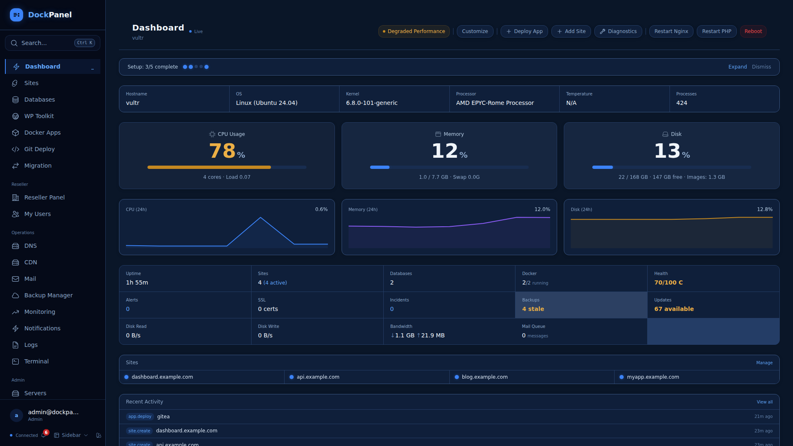
</p>

<h1 align="center">Arcpanel</h1>

<p align="center">
  <strong>The most feature-packed free server panel ever built.</strong><br>
  Self-hosted. Docker-native. Written in Rust. Panel services run on <strong>~19MB of RAM</strong>. 733 API endpoints. 152 app templates. 425 E2E tests. ~41MB binaries. Zero subscriptions.
</p>

<p align="center">
  <a href="https://github.com/phuongnamsoft/arcpanel/releases"></a>
  <a href="https://github.com/phuongnamsoft/arcpanel/actions"></a>
  <a href="LICENSE"></a>
</p>

<p align="center">
  <a href="https://arcpanel.top">Website</a> &bull;
  <a href="https://docs.arcpanel.top">Docs</a> &bull;
  <a href="CHANGELOG.md">Changelog</a> &bull;
  <a href="https://github.com/phuongnamsoft/arcpanel/discussions">Discussions</a>
</p>

---

## Install

```bash
curl -sL https://arcpanel.top/install.sh | sudo bash
```

Open `http://YOUR_SERVER_IP:8443`, create your admin account, done.

Supports Ubuntu 20+, Debian 11+, CentOS 9+, Rocky 9+, Fedora 39+, Amazon Linux 2023. x86_64 and ARM64.

## Why Arcpanel?

No other free panel gives you Git push-to-deploy with blue-green zero-downtime updates, 152 one-click Docker app templates, per-image CVE scanning with deploy gating, a WAF, passkey login, GPU passthrough, multi-server management, reseller accounts, a developer CLI, and Infrastructure as Code — all while the panel services themselves use under 20MB of RAM. Arcpanel does.

| | Arcpanel | HestiaCP | CloudPanel | RunCloud |
|---|---|---|---|---|
| **Price** | **Free** | Free | Free | $8/mo+ |
| **Stack** | **Rust + React** | PHP | PHP | PHP (SaaS) |
| **Docker native** | **152 templates** | No | No | No |
| **Git deploy** | **Blue-green, zero-downtime** | No | No | Basic |
| **Multi-server** | **Unlimited** | No | No | Yes |
| **Reseller + white-label** | **Yes** | Reseller only | No | No |
| **CLI + IaC** | **Full CLI + YAML export** | Limited | No | No |
| **RAM usage (panel)** | **~19MB** | ~200MB+ | ~150MB+ | SaaS |
| **ARM64 / Homelab** | **Yes** | Partial | No | No |
| **Self-hosted** | **Yes** | Yes | Yes | No |

## Screenshots

<details>
<summary><strong>Dashboard</strong> — Live server metrics, 24h graphs, site overview, recent activity</summary>


</details>

<details>
<summary><strong>Sites</strong> — Static, PHP, Node.js, Python, reverse proxy with Nginx + SSL</summary>

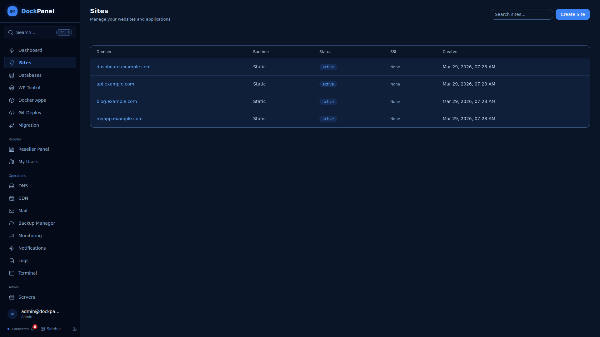
</details>

<details>
<summary><strong>Site Detail</strong> — SSL, WAF, file manager, terminal, backups, resource limits, custom nginx</summary>

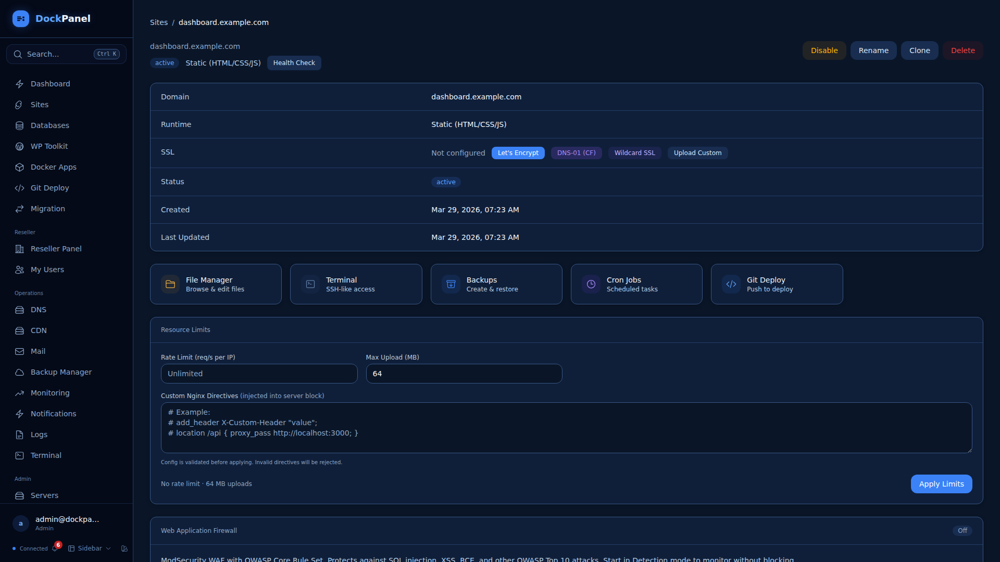
</details>

<details>
<summary><strong>Docker Apps</strong> — 152 one-click templates across 14 categories</summary>

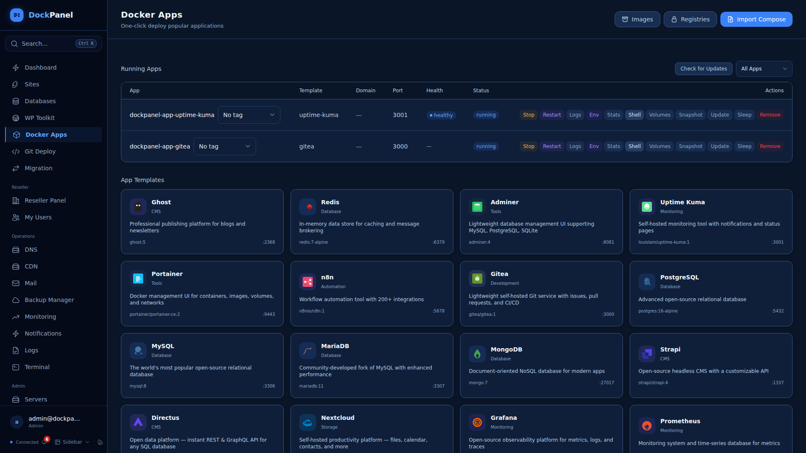
</details>

<details>
<summary><strong>Databases</strong> — MySQL/PostgreSQL, SQL browser, schema viewer, point-in-time recovery</summary>

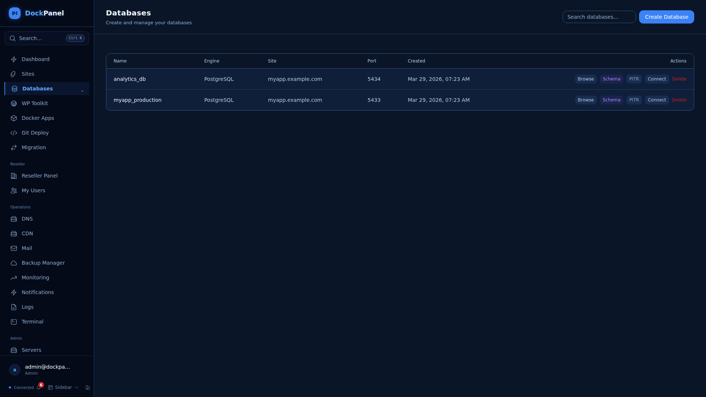
</details>

<details>
<summary><strong>File Manager</strong> — Browse, edit, upload files from the browser</summary>

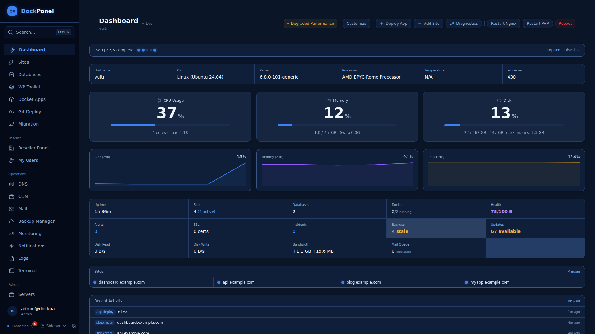
</details>

<details>
<summary><strong>Terminal</strong> — Full SSH in the browser with tabs, themes, session recording</summary>

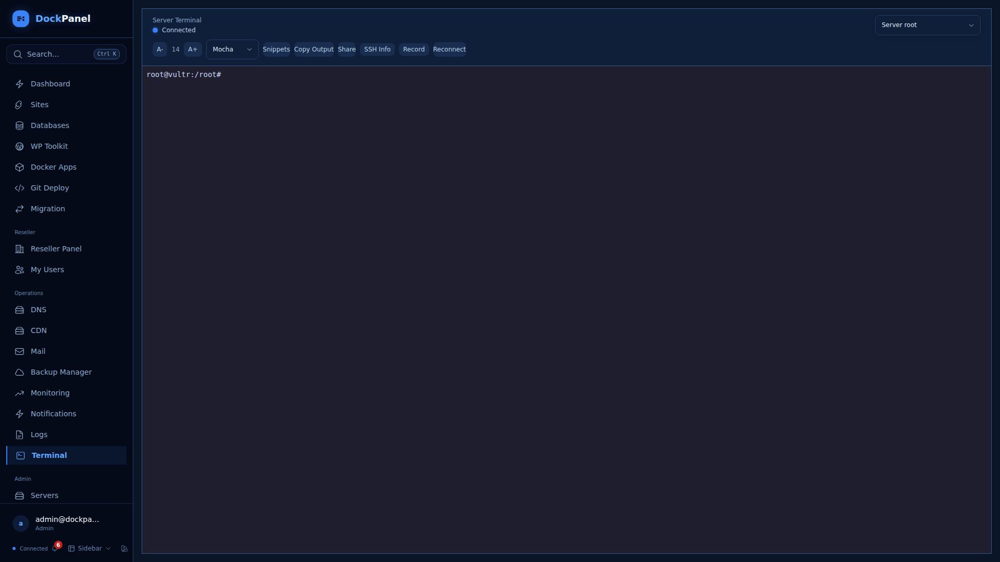
</details>

<details>
<summary><strong>Git Deploy</strong> — Push-to-deploy, atomic zero-downtime deploys, preview environments</summary>

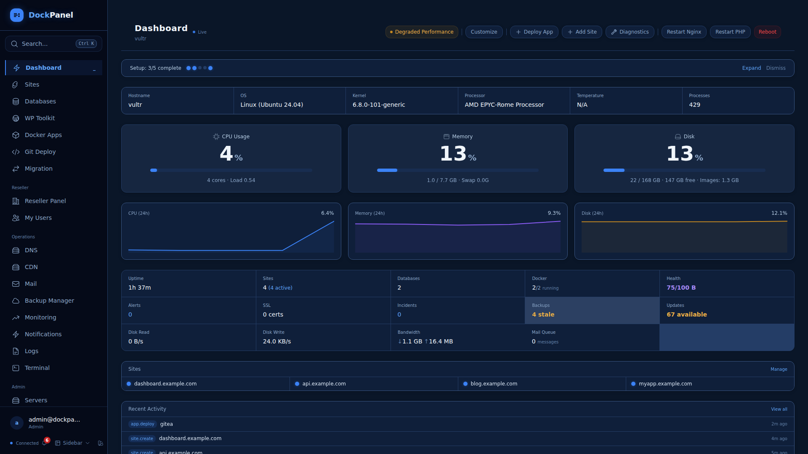
</details>

<details>
<summary><strong>Monitoring</strong> — HTTP/TCP/ping uptime checks, SLA tracking, PagerDuty integration</summary>

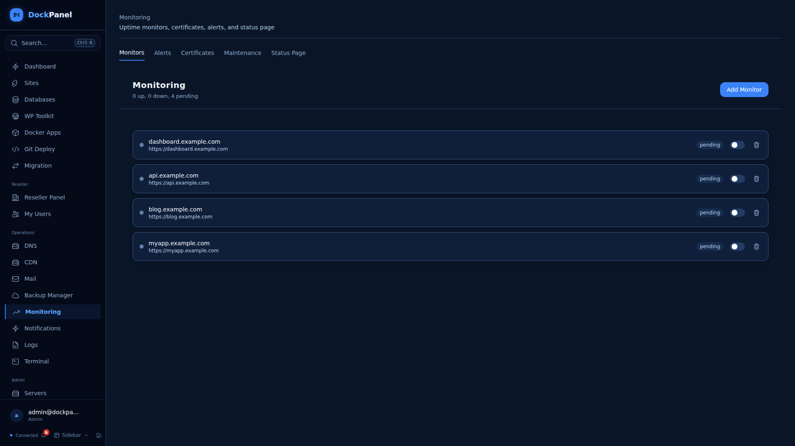
</details>

<details>
<summary><strong>Security</strong> — Firewall, Fail2Ban, SSH hardening, vulnerability scanning, audit logs</summary>

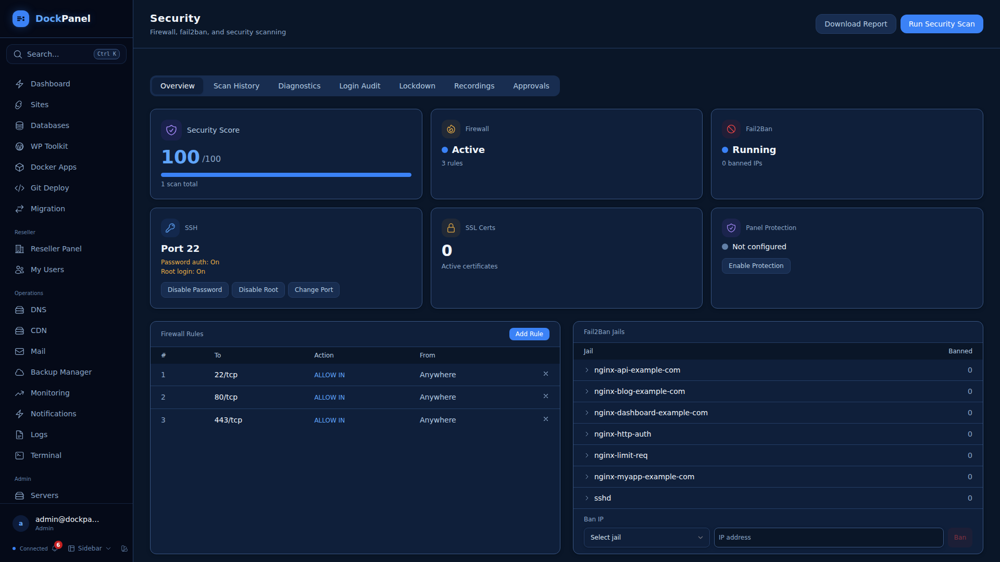
</details>

<details>
<summary><strong>Backups</strong> — Scheduled backups, S3/SFTP destinations, Restic incremental, one-click restore</summary>


</details>

<details>
<summary><strong>DNS</strong> — Cloudflare + PowerDNS, zone management, cache purge, security settings</summary>

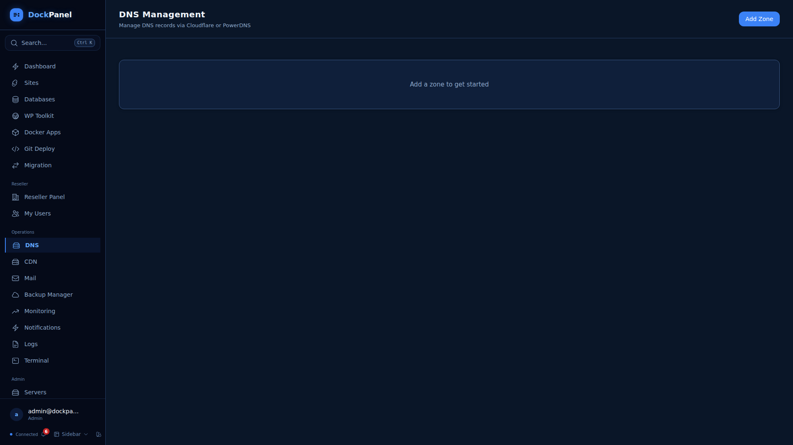
</details>

<details>
<summary><strong>Mail</strong> — Postfix + Dovecot + DKIM, Roundcube webmail, Rspamd spam filter</summary>


</details>

<details>
<summary><strong>Cron Jobs</strong> — Scheduled tasks with output logging</summary>

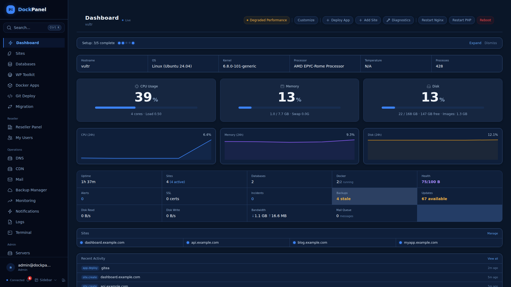
</details>

<details>
<summary><strong>System</strong> — Services, updates, diagnostics, auto-healing</summary>

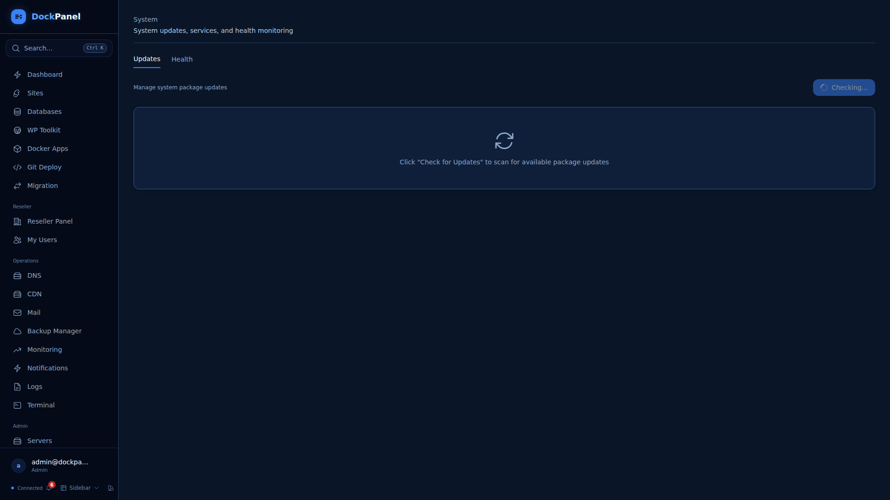
</details>

<details>
<summary><strong>Settings</strong> — Branding, notifications, alert channels, account security</summary>

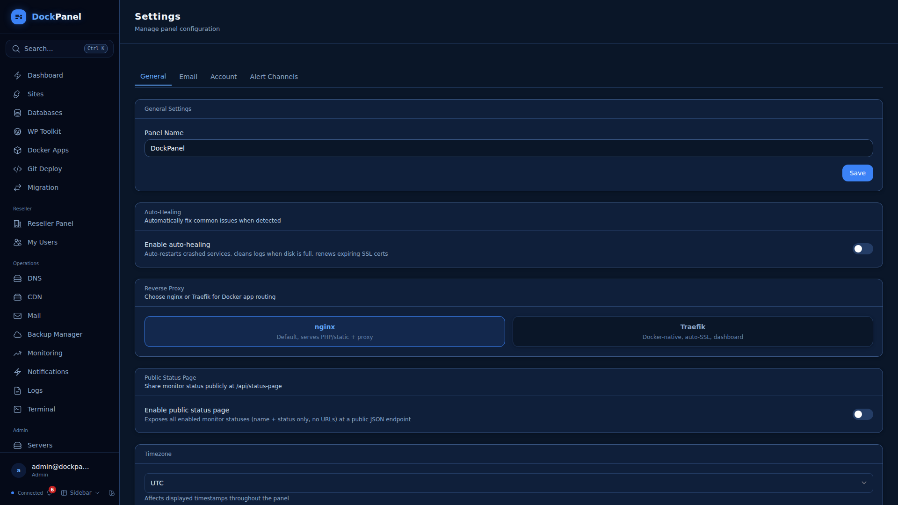
</details>

<details>
<summary><strong>Login</strong> — Email/password + passkey (WebAuthn) support</summary>

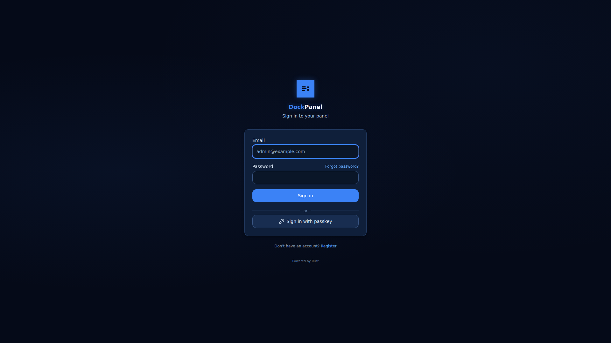
</details>

## Features

### Hosting
- **Sites** — Static, PHP (8.1-8.4), Node.js, Python, reverse proxy. Automatic Nginx config, SSL, PHP-FPM pools.
- **Databases** — MySQL/PostgreSQL in Docker. Built-in SQL browser, visual schema browser, point-in-time recovery (WAL/binlog). Auto-cleanup on site delete.
- **Docker Apps** — 152 templates across 14 categories (AI, CMS, Database, Media, Monitoring, and more). Compose stacks. Resource limits. GPU passthrough.
- **Git Deploy** — Push-to-deploy. Atomic zero-downtime deploys (Capistrano-style). Nixpacks (30+ languages). Preview environments.
- **WordPress Toolkit** — Multi-site dashboard, vulnerability scanning, security hardening, bulk updates.
- **CMS Install** — WordPress, Laravel, Drupal, Joomla, Symfony, CodeIgniter — one click.
- **Backups** — Scheduled, S3/SFTP remote destinations, one-click restore. Restic incremental (encrypted, deduplicated).
- **Backup Orchestrator** — DB/volume backups, AES-256 encryption, restore verification, cross-resource policies, S3/SFTP/B2/GCS destinations, health dashboard.
- **CDN** — BunnyCDN and Cloudflare CDN management. Cache purge, bandwidth stats, pull zone discovery.
- **Image Optimization** — Server-side WebP/AVIF conversion per site.
- **Secrets Manager** — AES-256-GCM encrypted vaults, version history, auto-inject to .env, masked API, CLI pull endpoint.
- **Webhook Gateway** — Inbound endpoints with unique URLs, HMAC-SHA256/SHA1 verification, request inspector, route builder, retry/replay.

### Operations
- **Multi-Server** — Manage remote servers from one panel. Agent auto-registers.
- **DNS** — Cloudflare + PowerDNS. Zone templates, propagation checker, DNSSEC. Cloudflare cache purge, security settings, Cloudflare Tunnel.
- **Container Management** — Auto-sleep (scale to zero), auto-update detection, per-user isolation policies, app migration between servers.
- **Mail** — Postfix + Dovecot + OpenDKIM. Webmail (Roundcube), spam filter (Rspamd), SMTP relay.
- **Monitoring** — HTTP/TCP/ping uptime checks, SLA tracking, PagerDuty integration.
- **Prometheus + Grafana** — Token-gated `/api/metrics` scrape endpoint (off by default) plus a drop-in [fleet dashboard](dashboards/arcpanel-grafana.json) covering CPU/memory/disk, GPU utilization/VRAM/temp/power, sites, and alerts. See [docs/guides/prometheus.md](docs/guides/prometheus.md).
- **Incident Management** — Full lifecycle (investigating, identified, monitoring, resolved, postmortem), severity levels, timeline, affected components.
- **Public Status Page** — Standalone dark-themed page at `/status`, component groups, email subscribers, overall status auto-computed from checks.
- **Terminal** — Full SSH with tabs, themes, sharing, session recording.

### Security
- **Passkey/WebAuthn** — Passwordless login with biometrics or security keys. Plus 2FA/TOTP with recovery codes.
- **WAF** — ModSecurity3 + OWASP CRS v4 per site. Detection or prevention mode. Event viewer.
- **CSP & Bot Protection** — Per-site Content Security Policy headers and bot rate limiting.
- **Firewall** — UFW management with smart port opener.
- **Fail2Ban** — View/ban/unban IPs, panel-specific jail.
- **SSH Hardening** — Disable password/root login, change port — one click.
- **Vulnerability Scanning** — File integrity, security headers, full-server audits.
- **Per-Image CVE Scanning** — Scan every running Docker app's image with Anchore grype. Severity badge per app row on the Apps page. Scheduled background rescans (configurable interval). Soft deploy gate refuses deploys on images exceeding a critical/high/medium threshold. Grype installs self-contained into `/var/lib/arcpanel/scanners/` from the Settings UI. **Defaults to off** — opt in from Settings → Services → Image Vulnerability Scanning.
- **Signed Releases + SBOM** — Every release binary and its SPDX SBOM is signed in CI with cosign keyless via Sigstore (no long-lived signing key, recorded in the public Rekor transparency log). Verification snippet in [SECURITY.md](SECURITY.md#verifying-release-signatures).
- **Per-Image SBOM Generation** — Generate an SPDX 2.3 JSON SBOM for any deployed Docker app's image on demand (syft). Click "Download SBOM" in any app's scan drawer. Self-contained install at `/var/lib/arcpanel/scanners/syft`. **Defaults to off** — opt in from Settings → Services → SBOM Generation. Companion to image CVE scanning: composition vs. risk.
- **Auto-Healing** — Restart crashed services, clean disk, renew expiring SSL, auto-sleep idle containers.

### Developer Experience
- **CLI** — `arc status`, `sites`, `apps`, `diagnose`, `export`, `apply`
- **Infrastructure as Code** — Export/import server config as YAML. Terraform/Pulumi provider API with scoped IaC tokens.
- **Smart Diagnostics** — 6 check categories with one-click fixes. Auto-optimization recommendations.
- **File Manager** — Browse, edit, upload files from the browser.
- **Command Palette** — Ctrl+K to navigate anywhere.
- **Nginx FastCGI Cache** — Per-site toggle with smart bypass for logged-in users.
- **Redis Object Cache** — Per-site isolated Redis DB with WP auto-config.

### Themes & Layouts
- **6 Themes** — Terminal (hacker green), Midnight (navy blue), Ember (warm amber), Arctic (light teal), Clean (light blue SaaS), Clean Dark (GitHub-dark).
- **3 Layouts** — Sidebar (full sidebar nav), Compact (collapsible icon rail), Topbar (horizontal navbar).

### Business
- **Reseller Accounts** — Admin → Reseller → User hierarchy with quotas.
- **White-Label** — Custom logo, colors, panel name per reseller.
- **OAuth/SSO** — Google, GitHub, GitLab login.
- **Extension API** — Webhook events with HMAC signing and scoped API keys.
- **WHMCS Integration** — Provisioning, suspension, termination hooks. Auto-create users from billing.
- **Horizontal Auto-Scaling** — Rule-based CPU thresholds with min/max replicas and cooldown.
- **Migration Wizard** — Import from cPanel, HestiaCP. Plesk (beta). App migration between servers.
- **Teams** — Multi-user access with role-based permissions.

## Architecture

```
Browser → React 19 SPA → Nginx
                           ├── /api/* → API (Rust/Axum)
                           │              ├── PostgreSQL 16
                           │              └── Agent (Unix socket / HTTPS)
                           │                     └── Docker, Nginx, SSL, files, terminal
                           └── /*     → Frontend (static files)
```

**3 Rust binaries**: Agent (~21MB), API (~20MB), CLI (~1MB). Runtime RAM: ~12MB agent + ~7MB API ≈ 19MB for the panel itself; ~85MB with the bundled PostgreSQL. 11 background services.

| Component | Tech | Role |
|-----------|------|------|
| Agent | Rust/Axum | Root-level host operations (Docker, Nginx, SSL, files) |
| API | Rust/Axum + SQLx | Auth, business logic, multi-server dispatch, background tasks |
| CLI | Rust/Clap | Command-line interface for automation |
| Frontend | React 19 + Vite + Tailwind 4 | Browser UI with 6 themes + 3 layouts |

## Security

Arcpanel has undergone seven rounds of security auditing (280+ vulnerabilities found and fixed). Credentials are encrypted at rest with AES-256-GCM. All child processes run with sanitized environments. Per-image CVE scanning (grype) with optional deploy gating catches vulnerable images before they ship. See [SECURITY.md](SECURITY.md) for details.

## Development

```bash
git clone https://github.com/phuongnamsoft/arcpanel.git && cd dockpanel

# Start database
docker run -d --name arc-postgres \
  -e POSTGRES_USER=arc -e POSTGRES_PASSWORD=changeme -e POSTGRES_DB=arc_panel \
  -p 5450:5432 postgres:16

# Build
cargo build --release --manifest-path panel/agent/Cargo.toml
cargo build --release --manifest-path panel/backend/Cargo.toml
cargo build --release --manifest-path panel/cli/Cargo.toml
cd panel/frontend && npm install && npx vite build
```

See [CONTRIBUTING.md](CONTRIBUTING.md) for full development setup.

## CLI

```bash
arc status              # Server status (CPU, RAM, disk)
arc sites               # List all sites
arc apps                # List Docker apps
arc diagnose            # Run smart diagnostics
arc export -o config.yml  # Export server config as YAML
arc apply config.yml    # Apply config (Infrastructure as Code)
```

## Update / Uninstall

```bash
sudo bash /opt/arcpanel/scripts/update.sh     # Update
sudo bash /opt/arcpanel/scripts/uninstall.sh   # Remove
```

## Documentation

- [Live Docs](https://docs.arcpanel.top) — Getting started, guides, configuration
- [FEATURES.md](FEATURES.md) — Complete feature manifest (60+ features, ~280 capabilities)
- [CHANGELOG.md](CHANGELOG.md) — Version history
- [SECURITY.md](SECURITY.md) — Security model and vulnerability reporting
- [CONTRIBUTING.md](CONTRIBUTING.md) — Development setup and PR process

## License

Business Source License 1.1. Free to use on your own servers. See [LICENSE](LICENSE) for details.
